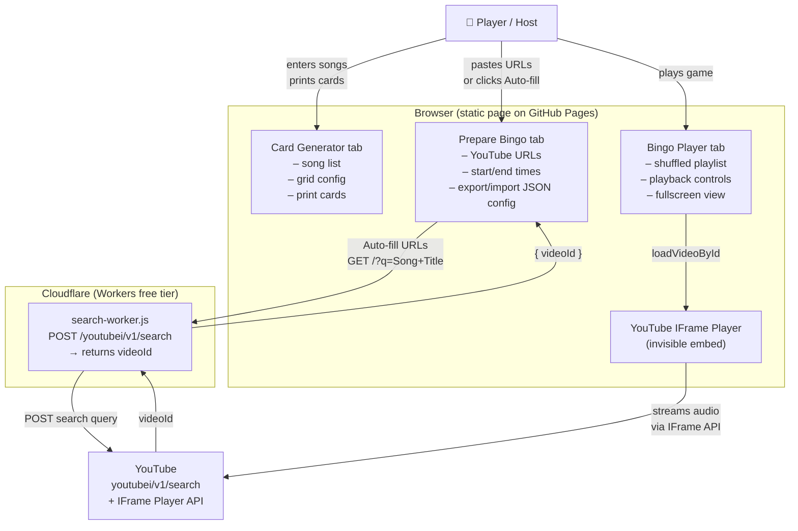

# Music Bingo Card Generator

A fully static web app to run a music bingo night: generate printable bingo cards, set up YouTube links for each song, and host a live game — all from a single HTML file with no backend required (except an optional Cloudflare Worker for the auto-fill feature).

Available in English, Spanish, Catalan and Basque.

---

## How to use

The app is divided into three tabs.

### 1. Card Generator

This is the starting point. Here you define the song list and configure the cards.

- **Song list** — enter one song per line using the format `Song Title - Artist`. You can type them manually or use the decade buttons (80s, 90s, 2000s, 2010s, 2020s — plus Spanish variants) to auto-populate 50 well-known songs from that era. Use the **Reset list** button to clear everything and start fresh.
- **Card configuration** — set a title for the cards, the grid size (columns × rows) and how many cards to generate.
- **Generate Bingo Cards** — produces the requested number of cards, each with a randomised selection of songs from the list arranged in a grid.
- **Print / Export PDF** — opens the browser print dialog so you can print the cards or save them as a PDF to distribute to players.

> Each player gets one card. During the game, they mark off songs as they are played. First player to complete a row, column or full card wins.

### 2. Prepare Bingo

Here you attach a YouTube video to each song so the app knows what to play.

- **URL column** — paste a YouTube link next to each song. The app accepts standard `youtube.com/watch?v=…` and `youtu.be/…` URLs.
- **Start / End columns** — optionally set the segment of the video to play, in `mm:ss` format. Leave blank to play the first 60 seconds.
- **Auto-fill URLs** — automatically searches YouTube for every song that does not yet have a URL and fills in the best match. Requires a Cloudflare Worker to be deployed (see the technical section below). Progress is shown next to the button in real time.
- **Preview button (▶)** — plays the configured segment immediately so you can verify it sounds right before the game.
- **Export Config** — saves all URLs and timings to a `.json` file. Load it back later with the file picker below to avoid re-entering everything.

### 3. Bingo Player

The game screen, designed to be shown on a projector or large monitor.

- **Play Bingo** — shuffles the song list and starts playback. Songs are played in random order; the song name is shown on screen so the host can announce it.
- **Pause / Resume / Prev / Next** — full playback controls. Volume fades out smoothly at the end of each segment before the next song starts.
- **Fullscreen** — expands to a presentation view showing the current song title, artist and a history of the last five played songs, ideal for projecting to the room.
- **Stop** — ends the session and returns to the ready state.

Audio is played through the **YouTube IFrame Player API**, embedded invisibly on the page. Because this uses the official YouTube embed, it respects the user's YouTube Premium status and handles regional availability automatically.

---

## Technical reference

### Architecture overview

The app is a **single static HTML file** (`index.html`) with no build step and no server-side logic. It is hosted on GitHub Pages and works entirely in the browser, with two external runtime dependencies:

1. The **YouTube IFrame Player API** (loaded from `youtube.com`) for audio playback.
2. An optional **Cloudflare Worker** (`search-worker.js`) for the auto-fill URL search feature.

### Third-party tools and APIs

#### YouTube IFrame Player API
- **What it does:** plays audio/video from YouTube inside a hidden `<iframe>` on the page. The app calls `loadVideoById({ videoId, startSeconds })` to start each song at the configured offset, and `setVolume()` to fade out at the end of each segment.
- **Why:** no CORS issues, no API key required, works with YouTube Premium (no ads for Premium users), handles geo-restrictions and age gates automatically.
- **Docs:** https://developers.google.com/youtube/iframe_api_reference
- **Quota:** none — the IFrame API is a free embed with no request limits.

#### YouTube Internal Search API (`youtubei/v1/search`)
- **What it does:** the same search endpoint that the YouTube website itself uses internally. Called from the Cloudflare Worker with a POST request containing the song name as the query. Returns a JSON tree from which the first `videoRenderer.videoId` is extracted.
- **Why:** no API key required, no daily quota (unlike the official YouTube Data API v3 which caps at 100 searches/day on the free tier), and fully reliable since it is YouTube's own infrastructure.
- **Caveat:** this is an undocumented internal endpoint. YouTube could change the response structure without warning. If auto-fill stops working, this is the most likely cause — the JSON path in `search-worker.js` would need updating.
- **Quota:** no enforced quota. In practice, a bingo session fills ~50 songs once, which is negligible.

#### Cloudflare Workers
- **What it does:** a serverless edge function that acts as a CORS proxy between the static page and YouTube's internal search API. The browser cannot call `youtube.com/youtubei/v1/search` directly due to browser CORS restrictions; the Worker makes the request server-side and returns the result with an `Access-Control-Allow-Origin: *` header.
- **Why:** Cloudflare Workers are free up to 100,000 requests/day with no credit card required, deploy in seconds from the browser, and have global low-latency edge infrastructure.
- **Setup:** deploy `search-worker.js` from the Cloudflare dashboard (Workers & Pages → Create Worker), then set `SEARCH_WORKER_URL` in `index.html` to your `*.workers.dev` URL.
- **Docs:** https://developers.cloudflare.com/workers/
- **Quota:** 100,000 requests/day on the free tier — far more than needed for any bingo event.

#### GitHub Pages
- **What it does:** serves `index.html` as a static website directly from this repository.
- **Why:** zero configuration, free, and a single HTML file is all that needs to be served.
- **Docs:** https://docs.github.com/en/pages
