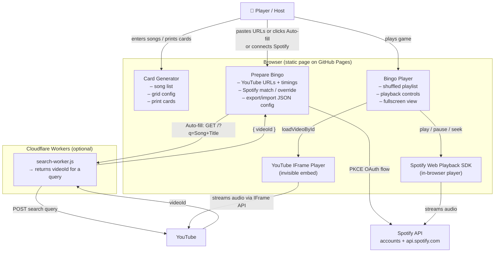

# Music Bingo Card Generator

A fully static web app to run a music bingo night: generate printable bingo cards, set up audio for each song via YouTube or Spotify, and host a live game — all from the browser with no backend required (except an optional Cloudflare Worker for the auto-fill feature).

Available in English, Spanish, Catalan and Basque. The language is auto-detected from your browser's preferred language settings, falling back to Spanish.

---

## How to use

The app is divided into three tabs.

### 1. Card Generator

This is the starting point. Here you define the song list and configure the cards.

- **Song list** — enter one song per line using the format `Song Title - Artist`. You can type them manually or use the decade buttons (80s, 90s, 2000s, 2010s, 2020s — plus Spanish variants for the 90s, 2000s and 2010s) to auto-populate 50 well-known songs from that era. Use the **Reset list** button to clear everything and start fresh.
- **Card configuration** — set a title for the cards, the grid size (columns × rows) and how many cards to generate.
- **Generate Bingo Cards** — produces the requested number of cards, each with a randomised selection of songs from your list arranged in a grid.
- **Print / Export PDF** — opens the browser print dialog so you can print the cards or save them as a PDF to distribute to players.

> Each player gets one card. During the game, they mark off songs as they are played. First player to complete a row, column or full card wins.

### 2. Prepare Bingo

Here you configure audio for each song. There are two playback options:

#### Option A — YouTube

- **URL column** — paste a YouTube link next to each song. Accepts standard `youtube.com/watch?v=…` and `youtu.be/…` URLs.
- **Start / End columns** — optionally set the segment of the video to play, in `mm:ss` format. Leave blank to play the first 60 seconds.
- **Auto-fill URLs** — automatically searches YouTube for every song without a URL and fills in the best match. Requires a Cloudflare Worker to be deployed (see the technical section below). Progress is shown in real time.
- **Preview (▶)** — plays the configured segment immediately so you can verify it sounds right.

YouTube may show ads before each video. If this is disruptive during the game, use Spotify instead.

#### Option B — Spotify Premium

Connect your Spotify Premium account for ad-free, uninterrupted playback.

- Click **Connect Spotify** in the Prepare Bingo tab.
- Once connected, songs are matched automatically by name — no URL needed.
- Use the **Preview (▶)** button to check each match. If Spotify picked the wrong track, tick the **Use YouTube** checkbox on that row to fall back to a specific YouTube URL for that song.
- Spotify and YouTube can be mixed freely within the same session.

> Spotify playback requires a **Spotify Premium** account. Free accounts do not support in-browser SDK playback.

#### Config files

- **Export Config** — saves all URLs, timings and override flags to a `.json` file.
- **Load Config File** — restores a previously exported config, including the full song list, so you can pick up exactly where you left off.

### 3. Bingo Player

The game screen, designed to be shown on a projector or large monitor.

- **Play Bingo** — shuffles the song list and starts playback. Songs play in random order; the song title is shown on screen for the host to announce.
- **Pause / Resume / Prev / Next** — full playback controls. Volume fades out smoothly at the end of each segment before the next song starts.
- **Fullscreen** — expands to a presentation view showing the current song title, artist name, a progress bar, and a history of the last five played songs. Ideal for projecting to the room.
- **Stop** — ends the session and returns to the ready state.
- A scrollable **queue** shows all songs played so far (upcoming songs are hidden to keep the suspense).

---

## Technical reference

### Project structure

The app is a **static site** with no build step. Source files:

```
index.html          — page structure and markup
styles.css          — all styles
js/
  main.js           — entry point: tab switching, language, song counter, init
  translations.js   — i18n strings for all four languages + t() helper
  utils.js          — pure helpers: parseSongs, validate, shuffle, format…
  data.js           — built-in decade song lists
  generator.js      — card generator feature
  youtube.js        — YouTube IFrame API wrapper
  spotify.js        — Spotify PKCE auth, Web Playback SDK, search & play
  prepare.js        — Prepare Bingo tab: table, export/import, auto-fill
  player.js         — bingo playback state machine, controls, fullscreen
```

JavaScript is loaded as native **ES modules** (`<script type="module">`). No bundler, no Node.js, no npm — the browser handles imports directly.

### Architecture overview



### Third-party tools and APIs

#### YouTube IFrame Player API
- **What it does:** plays audio from YouTube inside a hidden `<iframe>`. The app calls `loadVideoById({ videoId, startSeconds })` to start each song at the right offset, and `setVolume()` to fade out at the end of each segment.
- **Why:** no CORS issues, no API key, respects YouTube Premium (no ads for Premium users), handles geo-restrictions automatically.
- **Docs:** https://developers.google.com/youtube/iframe_api_reference
- **Quota:** none — the IFrame API is a free embed with no rate limits.

#### Spotify Web Playback SDK + Spotify API
- **What it does:** streams audio from Spotify directly inside the browser. The app uses the PKCE OAuth flow to authenticate, searches the Spotify catalogue by song name, and controls playback via the SDK (`play`, `pause`, `seek`, `setVolume`).
- **Why:** ad-free playback for Spotify Premium users, no additional infrastructure needed (the browser connects directly to Spotify).
- **Requires:** a Spotify app registered at [developer.spotify.com](https://developer.spotify.com). The client ID must be set in the GitHub secret `SPOTIFY_CLIENT_ID` and is injected into `js/spotify.js` at deploy time by the GitHub Actions workflow. The redirect URI must be set to your GitHub Pages URL in the Spotify app settings.
- **Docs:** https://developer.spotify.com/documentation/web-playback-sdk
- **Quota:** Spotify API calls (search, play) are subject to standard rate limits, which are far above what any bingo session would reach.

#### Cloudflare Workers (auto-fill URLs)
- **What it does:** a serverless function that acts as a CORS proxy between the static page and YouTube's internal search endpoint. The browser cannot call the search API directly due to CORS restrictions; the Worker makes the request server-side and returns `{ videoId }`.
- **Why:** free up to 100,000 requests/day, no credit card required, globally distributed.
- **Setup:** deploy `search-worker.js` from the Cloudflare dashboard (Workers & Pages → Create Worker), then set the `SEARCH_WORKER_URL` constant in `js/prepare.js` to your `*.workers.dev` URL.
- **Docs:** https://developers.cloudflare.com/workers/
- **Quota:** 100,000 requests/day on the free tier — far more than needed for any bingo event.

#### GitHub Pages + GitHub Actions
- **Hosting:** the site is served directly from this repository via GitHub Pages.
- **Deploy workflow:** `.github/workflows/deploy.yml` replaces the `__SPOTIFY_CLIENT_ID__` placeholder in `js/spotify.js` with the value of the `SPOTIFY_CLIENT_ID` repository secret at deploy time, then publishes the site.
- **Docs:** https://docs.github.com/en/pages
